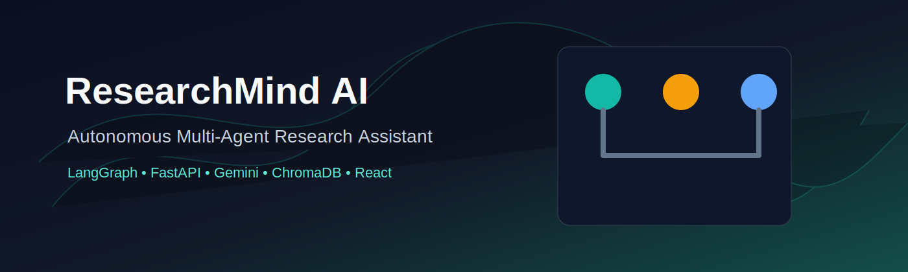
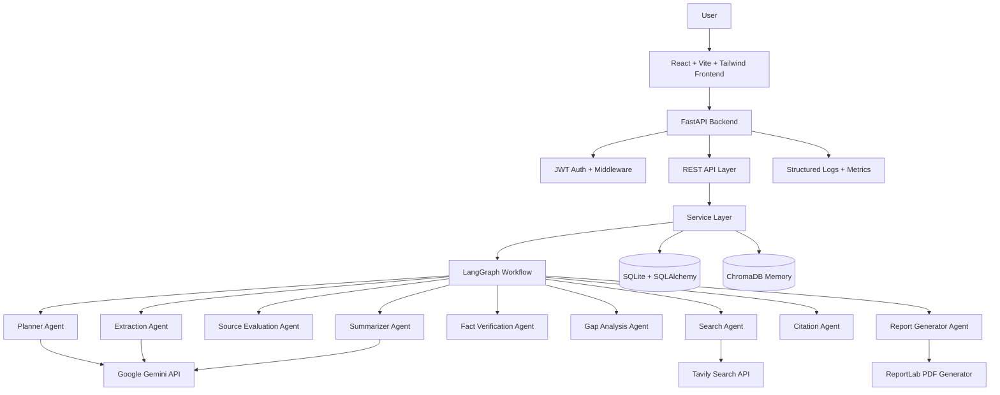
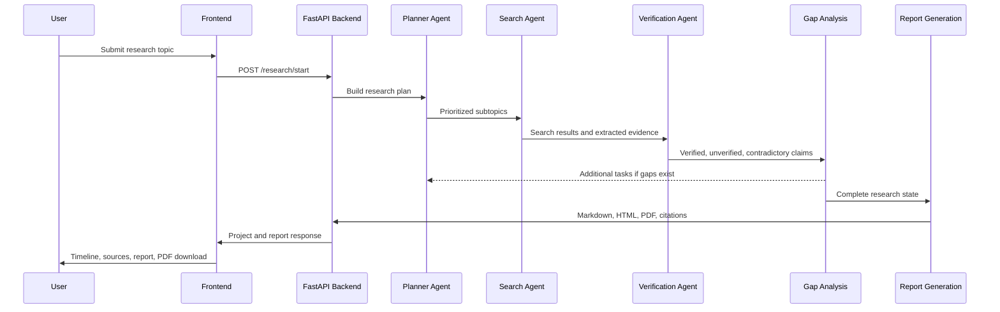
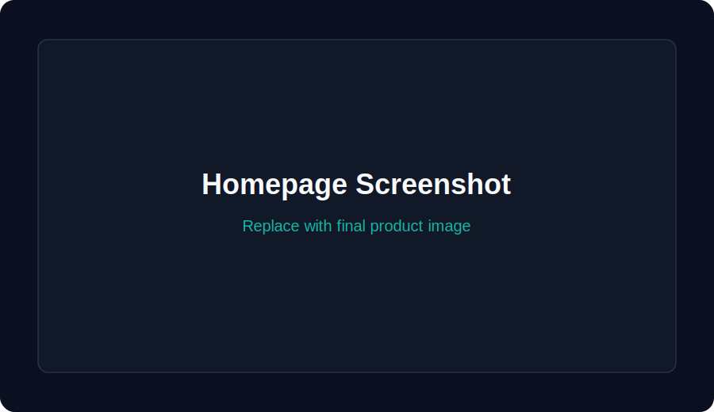
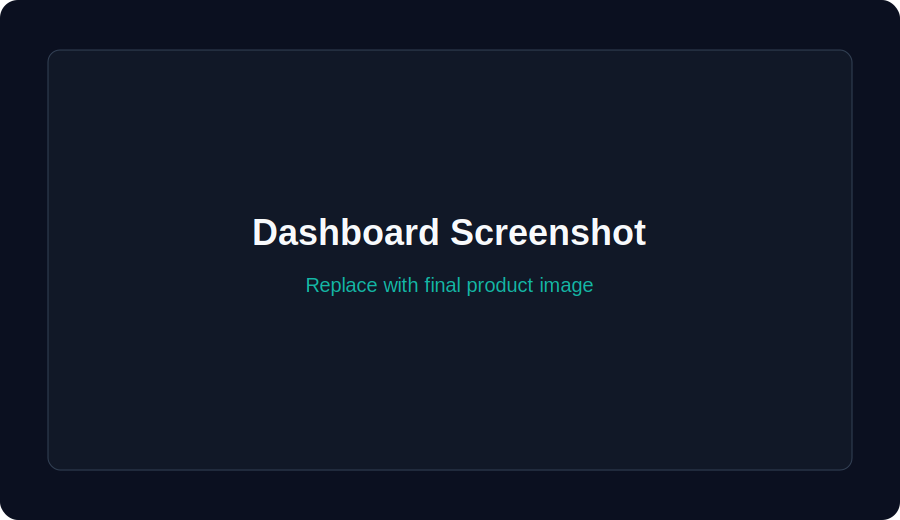
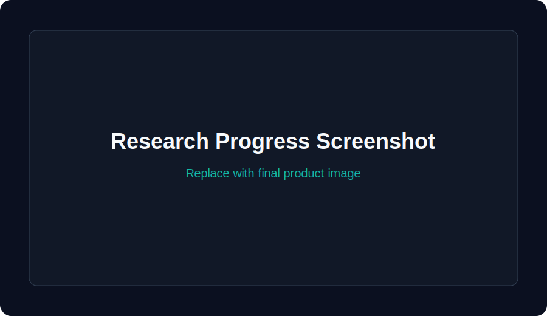
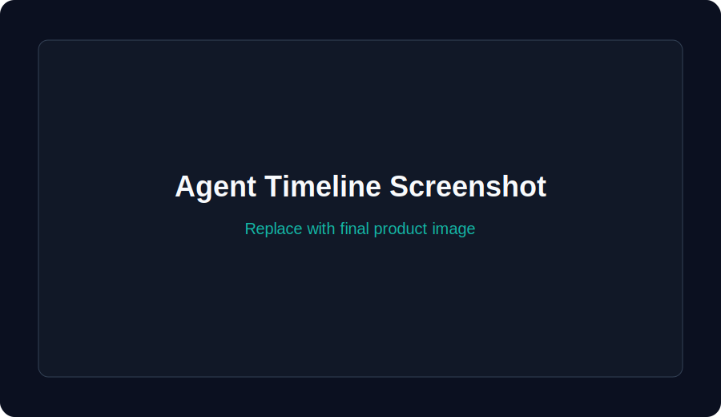
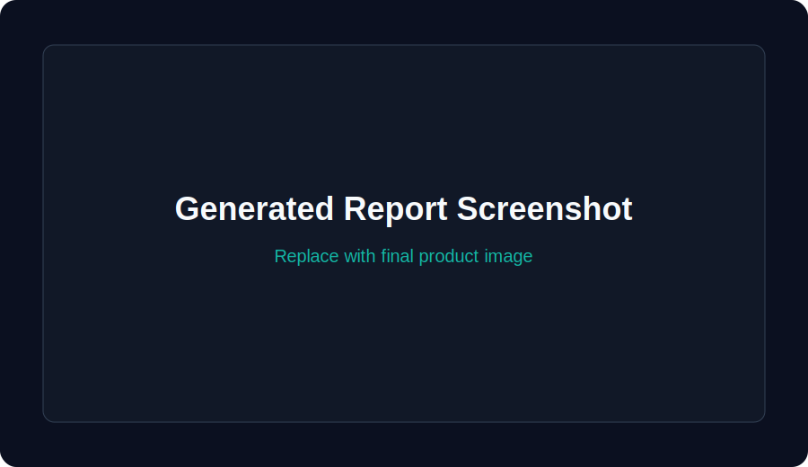
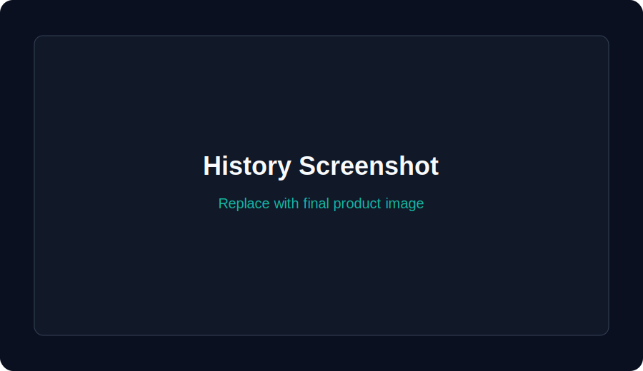
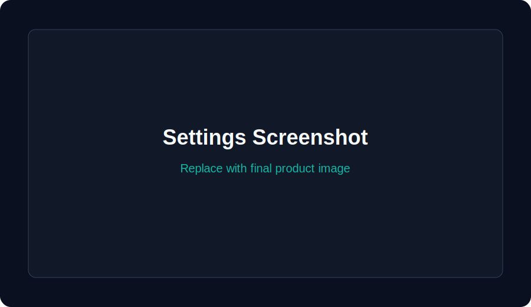

# ResearchMind AI

<p align="center">
  
</p>

<h3 align="center">Autonomous Multi-Agent Research Assistant</h3>

<p align="center">
  <strong>Plan research, search the web, verify sources, close knowledge gaps, generate citations, and export professional reports.</strong>
</p>

<p align="center">
  
  
  
  
  
  
  
</p>



## Problem Statement

Research is slow, repetitive, and error-prone. A person researching a complex topic usually has to break the question into subtopics, search the web, decide which sources are credible, extract useful facts, verify conflicting claims, format citations, and manually assemble a report. Generic chatbots collapse these steps into one opaque answer, which makes it hard to audit evidence, detect weak sections, or trust the final output.

## Solution

ResearchMind AI is a production-style autonomous research platform. It uses a LangGraph workflow with nine specialized agents that communicate through a shared `ResearchState`. Each agent owns one responsibility: planning, search, source evaluation, extraction, verification, gap analysis, summarization, citation, or report generation. The backend persists projects, reports, sessions, citations, memory, execution logs, and agent telemetry with FastAPI, SQLAlchemy, SQLite, ChromaDB, JWT authentication, and ReportLab.

## Architecture



## Sequence Diagram



## Features

- Autonomous LangGraph workflow with retry logic and execution history
- Nine single-responsibility AI agents
- Gemini-powered planning, extraction, and summarization
- Tavily-powered web search per subtopic
- Source trust scoring with freshness, academic, government, and industry signals
- Fact verification with contradiction and unsupported-claim detection
- Gap analysis loop for incomplete or low-confidence sections
- APA, IEEE, and MLA citation generation
- Professional markdown, HTML, and PDF reports
- JWT authentication, refresh tokens, logout, and protected routes
- SQLAlchemy persistence for users, projects, sessions, reports, history, memory, logs, citations, and agent executions
- ChromaDB memory search and storage
- Request logging, metrics, rate limiting, CSRF checks, security headers, and environment validation
- Docker, Docker Compose, Nginx, Render, Railway, and VPS deployment assets
- Responsive React UI with dark mode, progress timeline, source cards, report viewer, and history

## Tech Stack

| Layer | Technology |
| --- | --- |
| Frontend | React 18, Vite, TailwindCSS, Lucide Icons |
| Backend | Python 3.12, FastAPI, Pydantic |
| Agent Workflow | LangGraph |
| LLM | Google Gemini API |
| Search | Tavily Search API |
| Database | SQLite, SQLAlchemy, Alembic |
| Memory | ChromaDB |
| Auth | JWT, Passlib bcrypt |
| Reports | ReportLab, Markdown, HTML |
| DevOps | Docker, Docker Compose, Nginx, GitHub Actions |
| Monitoring | `/health`, `/metrics`, structured logs |

## Folder Structure

```text
researchmind-ai/
├── .github/workflows/          # CI pipeline for tests, frontend build, backend checks, Docker verification
├── backend/
│   ├── agents/                 # Single-responsibility research agents
│   ├── api/                    # FastAPI routers for auth, research, reports, memory, system
│   ├── config/                 # Environment-driven application settings
│   ├── database/               # SQLAlchemy sessions and Alembic migrations
│   ├── graph/                  # LangGraph orchestration workflow
│   ├── memory/                 # ChromaDB memory adapter
│   ├── middleware/             # Auth context, logging, rate limiting, security, timeout, errors
│   ├── models/                 # SQLAlchemy models and workflow state models
│   ├── repositories/           # Database access layer
│   ├── schemas/                # Pydantic request and response schemas
│   ├── services/               # Business logic for auth, research, reports, memory, recovery
│   ├── tests/                  # Pytest API, auth, DB, workflow, and E2E tests
│   ├── utils/                  # Gemini, Tavily, PDF, cache, logging, metrics, sanitization
│   ├── Dockerfile              # Backend container image
│   └── main.py                 # FastAPI application entry point
├── docs/
│   ├── assets/                 # Logo, banner, screenshot, and demo placeholders
│   ├── agents.md               # Agent documentation
│   ├── api.md                  # Endpoint reference
│   ├── architecture.md         # System diagrams and architecture notes
│   ├── deployment.md           # Docker, Render, Railway, VPS deployment guide
│   ├── index.md                # GitHub Pages documentation index
│   └── _config.yml             # GitHub Pages/Jekyll config
├── frontend/
│   ├── src/                    # React application source
│   ├── Dockerfile              # Frontend static build image
│   ├── nginx.conf              # Static file serving config
│   └── package.json            # Frontend dependencies and scripts
├── nginx/                      # Production reverse proxy config
├── .dockerignore               # Docker build exclusions
├── .env.example                # Development environment template
├── .env.production.example     # Production environment template
├── .gitignore                  # Git exclusions
├── alembic.ini                 # Migration config
├── CHANGELOG.md                # Release history
├── CODE_OF_CONDUCT.md          # Community standards
├── CONTRIBUTING.md             # Contribution workflow
├── docker-compose.yml          # Development Compose stack
├── docker-compose.prod.yml     # Production Compose stack
├── LICENSE                     # MIT license
├── railway.json                # Railway deployment config
├── render.yaml                 # Render deployment blueprint
├── requirements.txt            # Backend dependencies
└── README.md                   # Repository overview
```

## Installation

### Backend

```bash
cd researchmind-ai
python -m venv .venv
source .venv/bin/activate
pip install -r requirements.txt
cp .env.example .env
alembic upgrade head
uvicorn backend.main:app --reload --port 8000
```

Windows PowerShell:

```powershell
cd researchmind-ai
python -m venv .venv
.venv\Scripts\activate
pip install -r requirements.txt
copy .env.example .env
alembic upgrade head
uvicorn backend.main:app --reload --port 8000
```

### Frontend

```bash
cd frontend
npm ci
npm run dev
```

Open `http://localhost:5173`.

### Docker

```bash
cp .env.example .env
docker compose up --build
```

Production:

```bash
cp .env.production.example .env.production
docker compose -f docker-compose.prod.yml up --build -d
```

## Environment Variables

| Variable | Required | Description |
| --- | --- | --- |
| `APP_ENV` | No | `development` or `production` |
| `GEMINI_API_KEY` | Production | Google Gemini API key |
| `TAVILY_API_KEY` | Production | Tavily Search API key |
| `JWT_SECRET` | Production | Token signing secret, 32+ chars in production |
| `DATABASE_URL` | No | SQLAlchemy database URL |
| `CHROMA_PATH` | No | ChromaDB persistence path |
| `REPORTS_DIR` | No | PDF output directory |
| `LOGS_DIR` | No | Rotating log directory |
| `ALLOWED_ORIGINS` | No | CORS allowlist |
| `RATE_LIMIT_REQUESTS` | No | Requests per client per window |
| `REQUEST_TIMEOUT_SECONDS` | No | API timeout in seconds |

## API Documentation

Full reference: [docs/api.md](docs/api.md)

| Endpoint | Method | Purpose | Auth |
| --- | --- | --- | --- |
| `/health` | GET | Service health | No |
| `/metrics` | GET | Runtime metrics | No |
| `/auth/register` | POST | Create account | No |
| `/auth/login` | POST | Issue tokens | No |
| `/auth/refresh` | POST | Rotate refresh token | No |
| `/auth/logout` | POST | Revoke token | Optional |
| `/auth/profile` | GET | Current user profile | Yes |
| `/research/start` | POST | Run autonomous research workflow | Yes |
| `/research/history` | GET | Research execution history | Yes |
| `/research/{id}` | GET | Project detail, state, report, logs | Yes |
| `/research/{id}` | DELETE | Delete project | Yes |
| `/report/{id}` | GET | Report metadata and content | Yes |
| `/report/{id}/pdf` | GET | Download PDF | Yes |
| `/report/{id}/markdown` | GET | Download markdown | Yes |
| `/memory/store` | POST | Store user memory | Yes |
| `/memory/search` | GET | Search user memory | Yes |
| `/memory/clear` | DELETE | Clear user memory | Yes |

## Agent Documentation

Full reference: [docs/agents.md](docs/agents.md)

| Agent | Input | Output | Responsibility |
| --- | --- | --- | --- |
| Planner | `user_query`, missing topics | `research_plan`, `sub_topics` | Understand intent and create prioritized research tasks |
| Search | Research tasks | `search_results` | Search each subtopic with Tavily |
| Source Evaluation | Search results | `ranked_sources` | Score credibility, freshness, authority, and remove duplicate domains |
| Extraction | Ranked sources | `extracted_information` | Extract facts, statistics, definitions, examples, tables |
| Fact Verification | Extracted information | `verified_information` | Compare claims and classify evidence quality |
| Gap Analysis | Verified information | `missing_topics` | Detect weak sections and trigger follow-up research |
| Summarizer | Verified claims | `summaries` | Generate executive, detailed, bullet, and takeaway summaries |
| Citation | Ranked sources | `citations` | Generate APA, IEEE, and MLA references |
| Report Generator | Summaries, citations, verified claims | `report` | Produce markdown, HTML, PDF, TOC, sections, conclusion |

## Screenshots

| Screen | Preview |
| --- | --- |
| Homepage |  |
| Dashboard |  |
| Research Progress |  |
| Agent Timeline |  |
| Generated Report |  |
| History |  |
| Settings |  |

## Demo

Demo GIF placeholder: `docs/assets/demo.gif`

## Roadmap

### Completed

- Multi-agent LangGraph workflow
- Gemini and Tavily integration
- Source scoring, verification, gap analysis
- PDF, markdown, HTML report generation
- JWT auth, protected routes, refresh tokens
- SQLite, SQLAlchemy, Alembic
- ChromaDB memory
- Metrics, logs, rate limiting, security headers
- Docker, Nginx, Render, Railway, VPS docs
- React research dashboard

### Upcoming Features

- Streaming workflow events over WebSockets or Server-Sent Events
- Human review gates for high-risk research domains
- DOCX export
- Team workspaces and project sharing
- Postgres deployment profile
- Automated source metadata enrichment
- Evaluation harness for factuality and citation quality

## Project Metrics

| Metric | Estimate |
| --- | --- |
| Lines of code and documentation | ~5,900 |
| Source and documentation files | ~90 |
| REST APIs | 17 |
| Specialized agents | 9 |
| Retry attempts per agent | 3 |
| Report formats | Markdown, HTML, PDF |
| Performance improvements | Parallel subtopic search, TTL report/research cache, DB connection pooling, request timeout handling |

## Resume Bullet Points

- Built an autonomous multi-agent research platform using LangGraph, FastAPI, React, and Gemini API.
- Designed nine specialized AI agents for planning, web research, source verification, gap analysis, summarization, citation generation, and report creation.
- Implemented a shared `ResearchState` architecture to coordinate agents, retries, execution history, and research artifacts.
- Integrated Tavily Search API for subtopic-level web research and source collection.
- Developed source credibility scoring using trust, freshness, academic, government, and industry authority signals.
- Built fact verification workflows to identify verified claims, unsupported claims, contradictions, and missing evidence.
- Implemented ChromaDB memory, JWT authentication, password hashing, protected routes, and production REST APIs.
- Generated professional markdown, HTML, and PDF reports with APA, IEEE, and MLA citations.
- Added SQLAlchemy persistence for users, projects, sessions, reports, citations, logs, memory, and agent executions.
- Containerized the application with Docker, Nginx reverse proxy, GitHub Actions CI, and deployment guides for Render, Railway, and VPS.

## LinkedIn Project Description

**Professional Title:** ResearchMind AI - Autonomous Multi-Agent Research Assistant

**150-word description:**  
ResearchMind AI is a production-ready autonomous research platform that transforms a user-provided topic into a verified, cited, professional report. I built the system using a multi-agent LangGraph workflow with specialized agents for planning, web search, source evaluation, extraction, fact verification, gap analysis, summarization, citation generation, and report creation. The backend uses FastAPI, Gemini API, Tavily Search, SQLAlchemy, SQLite, ChromaDB memory, JWT authentication, and ReportLab PDF generation. The frontend is a responsive React/Vite/Tailwind dashboard with dark mode, research progress tracking, source trust cards, report viewing, and PDF download. The project includes production-grade middleware for logging, rate limiting, timeout handling, security headers, environment validation, metrics, Docker deployment, Nginx reverse proxy, CI/CD, and automated tests. It demonstrates practical AI engineering, agent orchestration, backend architecture, security, and DevOps readiness.

**Key Features:** Multi-agent workflow, source verification, gap analysis, citations, PDF reports, auth, memory, Docker, metrics.

**Tech Stack:** Python, FastAPI, LangGraph, Gemini, Tavily, SQLAlchemy, SQLite, ChromaDB, React, Vite, TailwindCSS, Docker, Nginx.

## Interview Preparation

1. **What problem does ResearchMind AI solve?**  
It automates the full research workflow: planning, search, source evaluation, extraction, verification, gap detection, summarization, citation, and report generation. It solves the trust and repeatability gap of single-response chatbot research.

2. **Why use LangGraph instead of a simple chain?**  
LangGraph supports explicit stateful workflows, conditional routing, retry handling, and loops. ResearchMind needs a gap-analysis loop that can route back to planning when information is incomplete.

3. **What is the shared state design?**  
All agents communicate through `ResearchState`, which stores query, plan, subtopics, search results, ranked sources, extracted information, verified information, missing topics, citations, report, history, current step, and logs.

4. **How are agents separated?**  
Each agent owns exactly one responsibility. For example, the Search Agent only searches, while the Source Evaluation Agent only scores and ranks sources.

5. **How does the Planner Agent work?**  
It interprets user intent, decomposes the topic into prioritized subtopics, and outputs structured research tasks.

6. **How does source evaluation work?**  
Sources are scored using trust score, domain authority, freshness, academic score, government score, industry score, content depth, and spam signals.

7. **How does fact verification work?**  
Extracted claims are compared across sources. Claims supported by multiple sources or high-trust sources are marked verified; weak claims are marked unverified or needing research.

8. **What does Gap Analysis do?**  
It identifies missing subtopics, weak evidence, contradictions, and low-confidence sections. If gaps exist, it creates additional tasks and routes back through the graph.

9. **Where is Gemini used?**  
Gemini supports planning, extraction, and summarization while deterministic backend logic handles scoring, routing, persistence, and report assembly.

10. **Why use Tavily?**  
Tavily is optimized for AI web search use cases and returns structured results that can be evaluated and cited.

11. **Why use ChromaDB?**  
ChromaDB stores extracted information and user memory for semantic retrieval across research sessions.

12. **Why SQLite?**  
SQLite keeps the project portable and easy to run locally. The SQLAlchemy architecture allows migration to Postgres for production scale.

13. **How is authentication implemented?**  
The backend uses JWT access tokens, refresh tokens, token revocation on logout, protected routes, and bcrypt password hashing through Passlib.

14. **How are reports generated?**  
The Report Generator Agent creates markdown, HTML, table of contents, numbered sections, citations, conclusion, and a ReportLab PDF.

15. **How do retries work?**  
Each LangGraph node retries failed agent execution up to three times and records attempts in execution history and logs.

16. **How is observability handled?**  
The app exposes `/health` and `/metrics`, writes rotating file logs, stores request logs in the database, and persists agent execution records.

17. **How is rate limiting implemented?**  
A middleware tracks client request timestamps and rejects clients that exceed the configured request window.

18. **What security controls are included?**  
JWT validation, password hashing, protected routes, CORS allowlist, CSRF double-submit validation, security headers, input sanitization, and production secret validation.

19. **How does deployment work?**  
The repo includes backend and frontend Dockerfiles, Docker Compose, production Compose, Nginx reverse proxy, Render blueprint, Railway config, and VPS deployment docs.

20. **How would you scale this system?**  
Move SQLite to Postgres, run research jobs in a worker queue, add Redis for distributed cache/rate limiting, stream graph events, and horizontally scale stateless API workers.

21. **How would you improve source metadata?**  
Add page parsing, author extraction, publication date normalization, DOI support, and citation metadata enrichment.

22. **How would you evaluate quality?**  
Use benchmark topics, human-rated source trust, claim-level precision/recall, citation correctness, contradiction detection accuracy, and report completeness scores.

23. **What prompt engineering techniques are used?**  
Structured JSON prompts, fallback deterministic outputs, task-specific prompts, constrained outputs, and separation of reasoning tasks by agent.

24. **What happens without API keys?**  
The app can run in local dry-run mode for smoke testing, while production startup validation requires real Gemini and Tavily keys.

25. **Why separate services and repositories?**  
Routes stay thin, business logic is testable, database access is isolated, and future persistence changes are easier.

26. **How does PDF generation handle content?**  
Report content is escaped before ReportLab rendering to avoid markup parsing issues and produce stable output.

27. **How does caching help?**  
TTL caches reduce repeated report and research lookups and improve responsiveness for frequently accessed artifacts.

28. **What is the biggest system design challenge?**  
Balancing autonomy with verifiability. The graph must generate useful research while preserving evidence, uncertainty, citations, and logs.

29. **How would you add streaming progress?**  
Persist graph events and expose Server-Sent Events or WebSockets from the backend to the frontend timeline.

30. **How would you make it multi-tenant?**  
Add organizations, roles, row-level ownership checks, shared projects, audit trails, and isolated memory collections per tenant.

## Elevator Pitch

**30 seconds:**  
ResearchMind AI is an autonomous multi-agent research assistant. A user enters a topic, and the system plans research, searches the web, evaluates source credibility, extracts facts, verifies claims, closes gaps, generates citations, and exports a professional PDF report. It is built with LangGraph, FastAPI, Gemini, Tavily, ChromaDB, SQLAlchemy, and React.

**2 minutes:**  
ResearchMind AI solves the problem of unreliable one-shot AI research. Instead of asking a chatbot for a single answer, it runs a structured multi-agent workflow. The Planner Agent breaks the topic into subtopics, the Search Agent collects sources, the Source Evaluation Agent ranks credibility, the Extraction Agent pulls useful evidence, the Verification Agent checks claims, the Gap Analysis Agent loops back when sections are weak, and the final agents produce summaries, citations, markdown, HTML, and PDF. The app includes JWT auth, persistent project history, ChromaDB memory, structured logging, metrics, Docker deployment, and a React dashboard.

**5 minutes:**  
ResearchMind AI is a production-oriented autonomous research platform built to demonstrate practical AI engineering beyond a chatbot. The core is a LangGraph workflow where nine single-responsibility agents communicate through a typed shared `ResearchState`. This makes the system auditable and extensible: every source, claim, gap, citation, report section, log, and execution step can be persisted and inspected. The backend is FastAPI with SQLAlchemy, SQLite, JWT authentication, Passlib hashing, ChromaDB memory, ReportLab PDF generation, structured logging, metrics, rate limiting, CSRF protection, security headers, and environment validation. The frontend is a modern React/Vite/Tailwind application for launching research, viewing agent progress, inspecting source trust scores, reading reports, downloading PDFs, and browsing history. The repo is packaged like a real open-source product with Dockerfiles, Compose, Nginx, Render/Railway deployment files, GitHub Actions, Alembic migrations, tests, and professional documentation.

## Contributing

See [CONTRIBUTING.md](CONTRIBUTING.md). Contributions should preserve the single-responsibility agent architecture, include tests for backend behavior, and avoid committing secrets or generated runtime artifacts.

## License

ResearchMind AI is released under the [MIT License](LICENSE).
