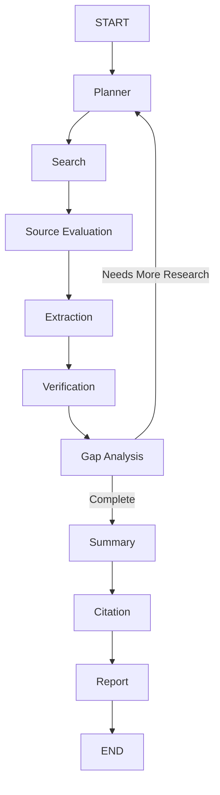

# Agent Documentation

ResearchMind AI uses nine specialized agents. Agents communicate through `ResearchState` and do not call each other directly. LangGraph controls routing, retries, and loop behavior.

## Planner Agent

**Input:** `user_query`, `missing_topics`, `depth`  
**Output:** `research_plan`, `sub_topics`  
**Responsibilities:**

- Understand the user's intent.
- Break the research topic into subtopics.
- Generate prioritized research tasks.
- Incorporate missing topics from previous gap analysis rounds.

## Search Agent

**Input:** `research_plan.tasks`  
**Output:** `search_results`  
**Responsibilities:**

- Search every subtopic independently.
- Use Tavily Search API.
- Collect title, URL, content, author, publication date, and domain.
- Run subtopic searches in parallel.

## Source Evaluation Agent

**Input:** `search_results`  
**Output:** `ranked_sources`  
**Responsibilities:**

- Remove duplicate websites.
- Calculate trust score, domain authority, freshness, academic score, government score, and industry score.
- Filter spam-like sources.
- Rank sources by credibility.

## Extraction Agent

**Input:** `ranked_sources`  
**Output:** `extracted_information`  
**Responsibilities:**

- Extract facts.
- Extract statistics.
- Extract important statements.
- Extract definitions.
- Extract examples.
- Extract tables when available.

## Fact Verification Agent

**Input:** `extracted_information`, `ranked_sources`  
**Output:** `verified_information`  
**Responsibilities:**

- Compare claims across sources.
- Detect contradictions.
- Identify unsupported claims.
- Identify missing evidence.
- Mark claims as `Verified`, `Unverified`, or `Needs More Research`.

## Gap Analysis Agent

**Input:** `verified_information`, `sub_topics`  
**Output:** `missing_topics`  
**Responsibilities:**

- Detect missing subtopics.
- Detect weak sections.
- Detect low-confidence information.
- Generate follow-up research tasks.
- Route the workflow back to planning when research is incomplete.

## Summarizer Agent

**Input:** verified and unverified claims  
**Output:** `summaries`  
**Responsibilities:**

- Generate executive summary.
- Generate detailed summary.
- Generate bullet summary.
- Generate key takeaways.

## Citation Agent

**Input:** `ranked_sources`  
**Output:** `citations`  
**Responsibilities:**

- Generate APA citations.
- Generate IEEE citations.
- Generate MLA citations.
- Preserve source URLs for auditability.

## Report Generator Agent

**Input:** `summaries`, `citations`, `verified_information`  
**Output:** `report`  
**Responsibilities:**

- Generate professional markdown.
- Convert report to HTML.
- Generate PDF with ReportLab.
- Create table of contents.
- Number sections.
- Append citations and conclusion.

## Workflow

## Reliability

- Each agent node retries up to three times.
- Failures are stored in `ResearchState.logs`.
- Execution timing is stored in `ResearchState.history`.
- Agent execution records are persisted to the database.
