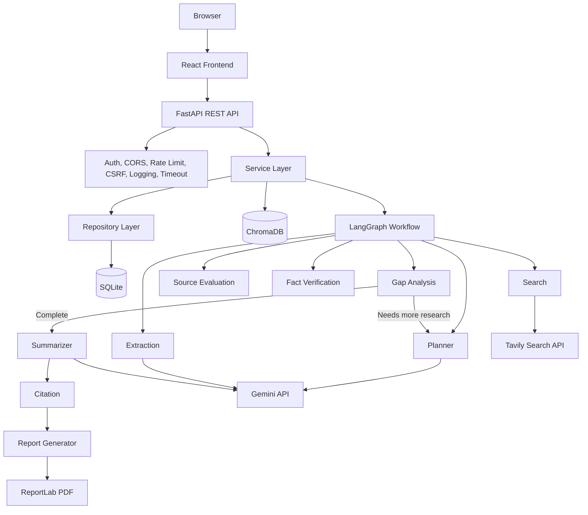
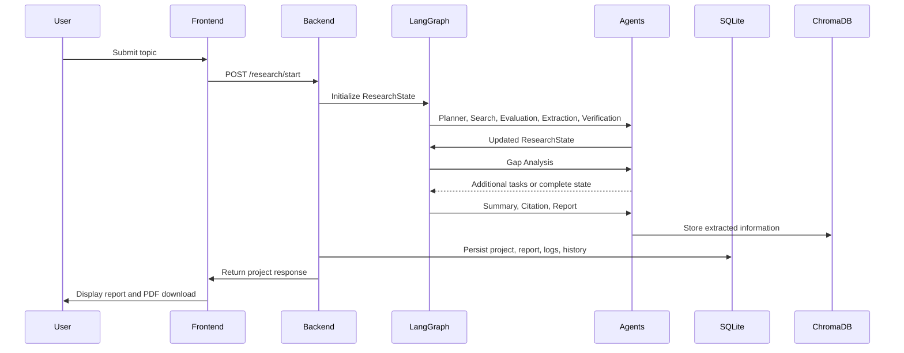

# Architecture

ResearchMind AI is organized as a production-style AI application with a React frontend, FastAPI backend, LangGraph orchestration layer, specialized agents, SQLAlchemy persistence, ChromaDB memory, Gemini LLM calls, Tavily web search, and ReportLab exports.

## System Diagram



## Request Lifecycle



## Backend Layers

- **API layer:** FastAPI routers validate requests and return typed responses.
- **Middleware layer:** CORS, JWT context, request logging, rate limiting, CSRF, security headers, timeout handling, and global exception formatting.
- **Service layer:** Coordinates business workflows for auth, research, memory, reports, and recovery.
- **Repository layer:** Encapsulates SQLAlchemy database operations.
- **Graph layer:** Defines the LangGraph workflow, retry behavior, conditional gap loop, memory storage, and execution history.
- **Agent layer:** Single-responsibility AI and deterministic processing units.
- **Utility layer:** Gemini, Tavily, PDF generation, metrics, logging, sanitization, and caching.

## Shared Research State

Every agent reads and writes a typed `ResearchState`:

```text
user_query
research_plan
sub_topics
search_results
ranked_sources
extracted_information
verified_information
missing_topics
citations
report
history
current_step
logs
```

## Reliability

- Each graph node retries failed agents up to three times.
- Agent execution history is persisted.
- Interrupted research projects are recovered on startup.
- Request timeouts protect API workers.
- Logs are written to both file and database.

## Security

- JWT access and refresh tokens.
- Passlib bcrypt password hashing.
- Protected routes.
- CORS allowlist.
- Rate limiting.
- CSRF double-submit validation when CSRF cookies are present.
- Security headers.
- Environment validation in production.

## Performance

- Parallel subtopic web search.
- SQLAlchemy connection pooling.
- TTL cache for reports and repeated research state.
- ChromaDB memory retrieval.
- Nginx compression and static asset caching.
